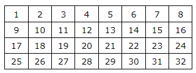

<h1 class="title">D. Матрица</h1>
<table>
<tr class="time-limit">
<td class="property-title">Ограничение времени</td>
<td>1&nbsp;секунда</td>
</tr>
<tr class="memory-limit">
<td class="property-title">Ограничение памяти</td>
<td>1Gb</td>
</tr>
<tr class="input-file">
<td class="property-title">Ввод</td>
<td colspan="1">стандартный ввод или input.txt</td>
</tr>
<tr class="output-file">
<td class="property-title">Вывод</td>
<td colspan="1">стандартный вывод или output.txt</td>
</tr>
</table>

<h2></h2>

<!--l. 48-->

Решение, корректно работающее в ограничениях&nbsp;<!--l. 48--><math display="inline" style="text-indent:
0em;" xmlns="http://www.w3.org/1998/Math/MathML"><mn>1</mn> <mo>≤</mo> <mi>n</mi><mi>m</mi> <mo>≤</mo> <msup><mrow><mn>2</mn></mrow><mrow><mn>4</mn></mrow></msup></math>, будет оценено в 2 балла.<!--l. 50-->

Полное решение будет оценено в 4 балла (включая 2 балла
за подзадачу выше).<!--l. 53-->

Дана матрица&nbsp;<!--l. 53--><math display="inline" style="text-indent: 0em;" xmlns="http://www.w3.org/1998/Math/MathML"><mi>n</mi>
<mo>×</mo> <mi>m</mi></math>&nbsp;(<!--l. 53--><math display="inline" style="text-indent: 0em;" xmlns="http://www.w3.org/1998/Math/MathML"><mi>n</mi></math>,
<!--l. 53--><math display="inline" style="text-indent: 0em;" xmlns="http://www.w3.org/1998/Math/MathML"><mi>m</mi></math>&nbsp;—
степени двойки), заполненная целыми числами от <!--l. 53--><math display="inline" style="text-indent: 0em;" xmlns="http://www.w3.org/1998/Math/MathML"><mn>1</mn></math>
до <!--l. 53--><math display="inline" style="text-indent: 0em;" xmlns="http://www.w3.org/1998/Math/MathML"><mi>n</mi><mi>m</mi></math>
(числа по возрастанию по строкам). <!--l. 55-->

Например, для <!--l. 55--><math display="inline" style="text-indent: 0em;" xmlns="http://www.w3.org/1998/Math/MathML"><mi>n</mi>
<mo>=</mo> <mn>4</mn></math> и <!--l. 55--><math display="inline" style="text-indent: 0em;" xmlns="http://www.w3.org/1998/Math/MathML"><mi>m</mi>
<mo>=</mo> <mn>8</mn></math> матрица имеет следующий вид: 

<!--l. 57-->

<!--l. 58-->

<!--l. 61-->

За один шаг мы «складываем» матрицу пополам, как лист бумаги, поперек большей стороны (по горизонтали
или по вертикали) и суммируем числа, которые накладываются друг на друга, до тех пор, пока не останется один элемент. Квадрат
складываем по горизонтальной линии. <!--l. 64-->

Элементы всех полученных матриц (в том числе и исходной) выписываем в одну последовательность.
<!--l. 66-->

Найдите количество различных выписанных чисел. 

<h2>Формат ввода</h2>

 В единственной строке входных данных записаны два числа <!--l. 69--><math display="inline" style="text-indent: 0em;" xmlns="http://www.w3.org/1998/Math/MathML"><mi>n</mi></math>
и <!--l. 69--><math display="inline" style="text-indent: 0em;" xmlns="http://www.w3.org/1998/Math/MathML"><mi>m</mi></math>&nbsp;(<!--l.
69--><math display="inline" style="text-indent: 0em;" xmlns="http://www.w3.org/1998/Math/MathML"><mn>1</mn> <mo>≤</mo> <mi>n</mi>
<mo>×</mo> <mi>m</mi> <mo>≤</mo> <msup><mrow><mn>2</mn></mrow><mrow><mn>3</mn><mn>0</mn></mrow></msup></math>). Оба числа
являются степенями двойки. 

<h2>Формат вывода</h2>

 Выведите единственное число&nbsp;— количество различных выписанных чисел. 

<h3>Пример 1</h3>
<table class="sample-tests">
<thead>
<tr>
<th>Ввод</th>
<th>Вывод</th>
</tr>
</thead>
<tbody>
<tr>
<td><pre>1 1
</pre></td>
<td><pre>1
</pre></td>
</tr>
</tbody>
</table>
<h3>Пример 2</h3>
<table class="sample-tests">
<thead>
<tr>
<th>Ввод</th>
<th>Вывод</th>
</tr>
</thead>
<tbody>
<tr>
<td><pre>1 8
</pre></td>
<td><pre>11
</pre></td>
</tr>
</tbody>
</table>
<h3>Пример 3</h3>
<table class="sample-tests">
<thead>
<tr>
<th>Ввод</th>
<th>Вывод</th>
</tr>
</thead>
<tbody>
<tr>
<td><pre>4 4
</pre></td>
<td><pre>21
</pre></td>
</tr>
</tbody>
</table>
