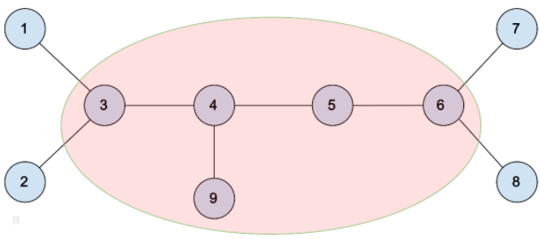
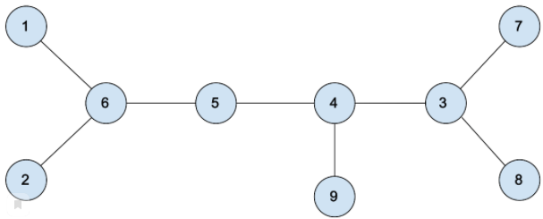

<h1 class="title">F. Переворот пути</h1>
<table>
<tr>
<th>Язык</th>
<th>Ограничение времени</th>
<th>Ограничение памяти</th>
<th>Ввод</th>
<th>Вывод</th>
</tr>
<tr>
<td width="1%">Все языки</td>
<td>2&nbsp;секунды</td>
<td>1Gb</td>
<td rowspan="7">стандартный ввод или input.txt</td>
<td rowspan="7">стандартный вывод или output.txt</td>
</tr>
<tr>
<td>
<nobr>Python 3.7.3</nobr>
</td>
<td>7&nbsp;секунд</td>
<td>1Gb</td>
</tr>
<tr>
<td>
<nobr>Python 3.7 (PyPy 7.3.3)</nobr>
</td>
<td>7&nbsp;секунд</td>
<td>1Gb</td>
</tr>
<tr>
<td>
<nobr>C# (MS .Net 5.0)+ASP</nobr>
</td>
<td>3&nbsp;секунды</td>
<td>1Gb</td>
</tr>
<tr>
<td>
<nobr>Kotlin 1.4.30 (JRE 11)</nobr>
</td>
<td>3&nbsp;секунды</td>
<td>1Gb</td>
</tr>
<tr>
<td>
<nobr>OpenJDK Java 11</nobr>
</td>
<td>3&nbsp;секунды</td>
<td>1Gb</td>
</tr>
<tr>
<td>
<nobr>Golang 1.16</nobr>
</td>
<td>3&nbsp;секунды</td>
<td>1Gb</td>
</tr>
</table>

<h2></h2>

<!--l. 48-->

Решение, корректно работающее в ограничениях&nbsp;<!--l. 48--><math display="inline" style="text-indent:
0em;" xmlns="http://www.w3.org/1998/Math/MathML"><mi>n</mi> <mo>≤</mo> <mn>2</mn><mn>0</mn><mn>0</mn><mn>0</mn></math>, будет оценено в 2 балла.<!--l. 50-->

Решение, корректно работающее для случая, когда максимальная
степень вершины не превосходит 2, будет оценено в 2 балла.<!--l. 52-->

Полное решение будет оценено в 7 баллов (включая 4 балла
за подзадачи выше).<!--l. 55-->

Дано дерево из <!--l. 55--><math display="inline" style="text-indent: 0em;" xmlns="http://www.w3.org/1998/Math/MathML"><mi>n</mi></math>
вершин. В нем выбрали две случайные различные вершины <!--l. 55--><math display="inline" style="text-indent: 0em;" xmlns="http://www.w3.org/1998/Math/MathML"><mi>p</mi></math>
и <!--l. 55--><math display="inline" style="text-indent: 0em;" xmlns="http://www.w3.org/1998/Math/MathML"><mi>q</mi></math>
(каждая пара вершин могла быть выбрана с одинаковой вероятностью) и перевернули путь между ними со всеми внутренними отростками,
не включая отростки от самих <!--l. 55--><math display="inline" style="text-indent: 0em;" xmlns="http://www.w3.org/1998/Math/MathML"><mi>p</mi></math>
и <!--l. 55--><math display="inline" style="text-indent: 0em;" xmlns="http://www.w3.org/1998/Math/MathML"><mi>q</mi></math>
(смотрите примеры для лучшего понимания). <!--l. 57-->

Найдите математическое ожидание расстояния между вершинами 1 и <!--l. 57--><math display="inline"
style="text-indent: 0em;" xmlns="http://www.w3.org/1998/Math/MathML"><mi>n</mi></math>. 

<h2>Формат ввода</h2>

<!--l. 62-->

В первой строке дано целое число <!--l. 62--><math display="inline" style="text-indent: 0em;"
xmlns="http://www.w3.org/1998/Math/MathML"><mi>n</mi></math> (<!--l. 62--><math display="inline" style="text-indent: 0em;"
xmlns="http://www.w3.org/1998/Math/MathML"><mn>2</mn> <mo>≤</mo> <mi>n</mi> <mo>≤</mo> <mn>2</mn><mn>0</mn><mn>0</mn><mspace
width="0.3em"><mn>0</mn><mn>0</mn><mn>0</mn></mspace></math>)&nbsp;— количество вершин в дереве. <!--l. 64-->

В следующих <!--l. 64--><math display="inline" style="text-indent: 0em;" xmlns="http://www.w3.org/1998/Math/MathML"><mi>n</mi>
<mo>−</mo> <mn>1</mn></math> строках даны два числа <!--l. 64--><math display="inline" style="text-indent: 0em;" xmlns="http://www.w3.org/1998/Math/MathML"><msub><mrow><mi>u</mi></mrow><mrow><mi>i</mi></mrow></msub></math>,
<!--l. 64--><math display="inline" style="text-indent: 0em;" xmlns="http://www.w3.org/1998/Math/MathML"><msub><mrow><mi>v</mi></mrow><mrow><mi>i</mi></mrow></msub></math>
(<!--l. 64--><math display="inline" style="text-indent: 0em;" xmlns="http://www.w3.org/1998/Math/MathML"><mn>1</mn> <mo>≤</mo>
<msub><mrow><mi>u</mi></mrow><mrow><mi>i</mi></mrow></msub><mo>,</mo><msub><mrow><mi>v</mi></mrow><mrow><mi>i</mi></mrow></msub>
<mo>≤</mo> <mi>n</mi><mo>,</mo><msub><mrow><mi>u</mi></mrow><mrow><mi>i</mi></mrow></msub><mo>≠</mo><msub><mrow><mi>v</mi></mrow><mrow><mi>i</mi></mrow></msub></math>)&nbsp;—
ребра дерева. 

<h2>Формат вывода</h2>

 Выведите целое число&nbsp;— математическое ожидание расстояния между вершинами 1 и <!--l. 68--><math display="inline" style="text-indent:
0em;" xmlns="http://www.w3.org/1998/Math/MathML"><mi>n</mi></math>, умноженное на <!--l. 68--><math display="inline" style="text-indent:
0em;" xmlns="http://www.w3.org/1998/Math/MathML"><mfrac><mrow><mi>n</mi><mrow><mo>(</mo><mrow><mi>n</mi><mo>−</mo><mn>1</mn></mrow><mo>)</mo></mrow></mrow>
<mrow><mn>2</mn></mrow></mfrac> </math>. 

<h3>Пример 1</h3>
<table class="sample-tests">
<thead>
<tr>
<th>Ввод</th>
<th>Вывод</th>
</tr>
</thead>
<tbody>
<tr>
<td><pre>4
1 2
2 3
3 4
</pre></td>
<td><pre>12
</pre></td>
</tr>
</tbody>
</table>
<h3>Пример 2</h3>
<table class="sample-tests">
<thead>
<tr>
<th>Ввод</th>
<th>Вывод</th>
</tr>
</thead>
<tbody>
<tr>
<td><pre>4
1 2
2 3
2 4
</pre></td>
<td><pre>10
</pre></td>
</tr>
</tbody>
</table>
<h3>Пример 3</h3>
<table class="sample-tests">
<thead>
<tr>
<th>Ввод</th>
<th>Вывод</th>
</tr>
</thead>
<tbody>
<tr>
<td><pre>4
1 4
2 4
3 4
</pre></td>
<td><pre>8
</pre></td>
</tr>
</tbody>
</table>
<h2>Примечания</h2>

<!--l. 73-->

Предположим, изначально дерево выглядело так: <!--l. 75-->

<!--l.
77-->

Если <!--l. 77--><math display="inline" style="text-indent: 0em;" xmlns="http://www.w3.org/1998/Math/MathML"><mi>p</mi>
<mo>=</mo> <mn>3</mn></math>, <!--l. 77--><math display="inline" style="text-indent: 0em;" xmlns="http://www.w3.org/1998/Math/MathML"><mi>q</mi>
<mo>=</mo> <mn>6</mn></math>, то после переворота оно преобразуется в следующее дерево: <!--l. 79-->

<!--l.
81-->

Обратите внимание, что ребро 4–9 осталось, так как это внутренний отросток на пути между
3 и 6. <!--l. 83-->

Но ребра 1–3 и 2–3 преобразовались в 1–6 и 2–6, так же как и ребра 6–7 и 6–8 преобразовались
в 3–7 и 3–8 соответственно. 

