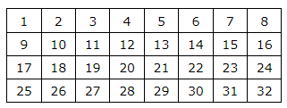
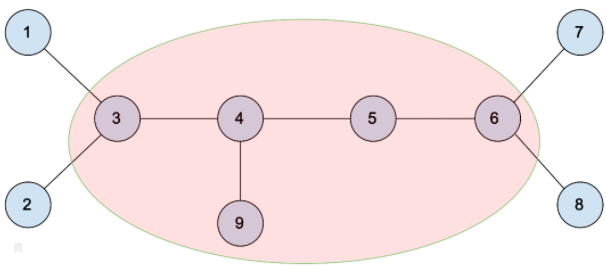
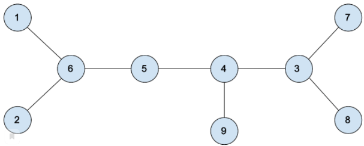

# Yandex Cup, Algorithm 2021

## Practice round

- [x] [A. Робот-секретарь (разминка)](#PracticeRound-A)
- [x] [B. Тестирование функции (разминка)](#PracticeRound-B)
- [ ] [C. Восстановить алфавит (разминка)](#PracticeRound-C)

## Qualification

- [x] [A. НольОдин](#Qualification-A)
- [ ] [B. Плитки 2x2](#Qualification-B)
- [ ] [C. Шары и коробки](#Qualification-C)
- [ ] [D. Матрица](#Qualification-D)
- [ ] [E. Сортировка матрицы](#Qualification-E)
- [ ] [F. Переворот пути](#Qualification-F)

На решение отводится 2 часа.

<h1 class="title" id="PracticeRound-A">A. Робот-секретарь (разминка)</h1>
<table>
<tr class="time-limit">
<td class="property-title">Ограничение времени</td>
<td>1&nbsp;секунда</td>
</tr>
<tr class="memory-limit">
<td class="property-title">Ограничение памяти</td>
<td>256Mb</td>
</tr>
<tr class="input-file">
<td class="property-title">Ввод</td>
<td colspan="1">стандартный ввод или input.txt</td>
</tr>
<tr class="output-file">
<td class="property-title">Вывод</td>
<td colspan="1">стандартный вывод или output.txt</td>
</tr>
</table>

<h2></h2>

Решение, проходящее все тесты, будет оценено в 2 балла.<!--l. 49-->

Настя любит программировать и увлекается старой компьютерной техникой. Однажды она увидела в
музее Яндекса робота для набора текста на печатной машинке. Настя захотела проверить, насколько оптимально работает робот.
<!--l. 51-->

Клавиатура печатной машинки состоит из 26 клавиш английского алфавита, клавиши пробела и
клавиши Shift, которая изменяет регистр следующей набранной буквы на противоположный текущему. Двойное же нажатие на клавишу
Shift изменяет текущий регистр машинки. В начале работы регистр всегда нижний, то есть при наборе без клавиши Shift будут
печататься строчные буквы. Пробел одинаково набирается в обоих регистрах. <!--l. 53-->

Настя хочет понять, за какое минимальное количество нажатий можно набрать текст, чтобы сравнить
это с результатами робота. <!--l. 55-->

Это разминочная задача, к которой мы размещаем готовое решения, чтобы вы могли познакомиться
с нашей автоматической системой проверки решений. Ввод и вывод осуществляется через файлы, либо через стандартные потоки ввода-вывода,
как вам удобнее. <!--l. 57-->

Пример решения на С++: <a href="./examples/PracticeRound-A.cpp">PracticeRound-A.cpp</a>.
В качестве компилятора выбирайте GNU C++ 14 4.9. 

<h2>Формат ввода</h2>

 Входные данные&nbsp;– строка <!--l. 60--><math display="inline" style="text-indent: 0em;" xmlns="http://www.w3.org/1998/Math/MathML"><mi>s</mi></math>
(<!--l. 60--><math display="inline" style="text-indent: 0em;" xmlns="http://www.w3.org/1998/Math/MathML"><mn>1</mn> <mo>≤</mo><mo>|</mo><mi>s</mi><mo>|</mo><mo>≤</mo>
<mn>1</mn><mn>0</mn><mn>0</mn><mspace width="0.3em"><mn>0</mn><mn>0</mn><mn>0</mn></mspace></math>), состоящая из прописных
и строчных букв английского алфавита, а также символа пробела. 

<h2>Формат вывода</h2>

 Выведите единственное число&nbsp;— минимальное количество нажатий, необходимое, чтобы напечатать данную строку. 

<h3>Пример 1</h3>
<table class="sample-tests">
<thead>
<tr>
<th>Ввод</th>
<th>Вывод</th>
</tr>
</thead>
<tbody>
<tr>
<td><pre>Hello World
</pre></td>
<td><pre>13
</pre></td>
</tr>
</tbody>
</table>
<h3>Пример 2</h3>
<table class="sample-tests">
<thead>
<tr>
<th>Ввод</th>
<th>Вывод</th>
</tr>
</thead>
<tbody>
<tr>
<td><pre>APPLE II
</pre></td>
<td><pre>10
</pre></td>
</tr>
</tbody>
</table>

<h1 class="title" id="PracticeRound-B">B. Тестирование функции (разминка)</h1>
<table>
<tr class="time-limit">
<td class="property-title">Ограничение времени</td>
<td>3&nbsp;секунды</td>
</tr>
<tr class="memory-limit">
<td class="property-title">Ограничение памяти</td>
<td>256Mb</td>
</tr>
<tr class="input-file">
<td class="property-title">Ввод</td>
<td colspan="1">стандартный ввод или input.txt</td>
</tr>
<tr class="output-file">
<td class="property-title">Вывод</td>
<td colspan="1">стандартный вывод или output.txt</td>
</tr>
</table>

<h2></h2>

Решение, проходящее все тесты первой группы, будет оценено в 1 балл.<!--l. 49-->

Решение, проходящее все тесты, будет оценено в 3 балла, т.е.
в 2 дополнительных балла.<!--l. 51-->

Чтобы написать тест, нужно проверить результат работы функции, которая возвращает массив.
Известен канонический результат, однако функция не обязана выдавать в точности его. Результат функции правильный, если он
может быть получен из канонического выполнением любого числа, возможно нулевого, следующих операций: 
<ol style="list-style-type:
decimal;">
<li>Переставить любые два элемента массива. </li>
<li>Добавить ко всем элементам массива одно и то же число. </li>
<li>Умножить все элементы массива на одно и то же ненулевое число.</li>
</ol>
<!--l. 58-->

Определите, правильный ли результат работы функции. <!--l. 60-->

Это разминочная задача, к которой мы размещаем готовое решения, чтобы вы могли познакомиться
с нашей автоматической системой проверки решений. Ввод и вывод осуществляется через файлы, либо через стандартные потоки ввода-вывода,
как вам удобнее. <!--l. 62-->

Пример решения на С++: <a href="./examples/PracticeRound-B.cpp">PracticeRound-B.cpp</a>.
. В качестве компилятора выбирайте GNU C++ 14 4.9. 

<h2>Формат ввода</h2>

 В первой строке задано число тестов <!--l. 65--><math display="inline" style="text-indent: 0em;" xmlns="http://www.w3.org/1998/Math/MathML"><mi>T</mi></math>
(<!--l. 65--><math display="inline" style="text-indent: 0em;" xmlns="http://www.w3.org/1998/Math/MathML"><mn>1</mn> <mo>≤</mo>
<mi>T</mi> <mo>≤</mo> <mn>1</mn><mn>0</mn><mn>0</mn><mn>0</mn></math>). В следующих строках идут описания <!--l. 65--><math
display="inline" style="text-indent: 0em;" xmlns="http://www.w3.org/1998/Math/MathML"><mi>T</mi></math> тестов. <!--l. 67-->

В первой строке теста задана длина <!--l. 67--><math display="inline" style="text-indent: 0em;"
xmlns="http://www.w3.org/1998/Math/MathML"><mi>N</mi></math> (<!--l. 67--><math display="inline" style="text-indent: 0em;"
xmlns="http://www.w3.org/1998/Math/MathML"><mn>0</mn> <mo>≤</mo> <mi>N</mi> <mo>≤</mo> <mn>1</mn><mn>0</mn><mn>0</mn><mspace
width="0.3em"><mn>0</mn><mn>0</mn><mn>0</mn></mspace></math>) канонического результата. В следующей строке заданы <!--l. 67--><math
display="inline" style="text-indent: 0em;" xmlns="http://www.w3.org/1998/Math/MathML"><mi>N</mi></math> элементов канонического
результата <!--l. 67--><math display="inline" style="text-indent: 0em;" xmlns="http://www.w3.org/1998/Math/MathML"><msub><mrow><mi>a</mi></mrow><mrow><mi>i</mi></mrow></msub></math>
(<!--l. 67--><math display="inline" style="text-indent: 0em;" xmlns="http://www.w3.org/1998/Math/MathML"> <mo>−</mo> <mn>1</mn><mspace
width="0.3em"><mn>0</mn><mn>0</mn><mn>0</mn><mspace width="0.3em"><mn>0</mn><mn>0</mn><mn>0</mn><mspace width="0.3em"><mn>0</mn><mn>0</mn><mn>0</mn>
<mo>≤</mo> <msub><mrow><mi>a</mi></mrow><mrow><mi>i</mi></mrow></msub> <mo>≤</mo> <mn>1</mn><mspace width="0.3em"><mn>0</mn><mn>0</mn><mn>0</mn><mspace
width="0.3em"><mn>0</mn><mn>0</mn><mn>0</mn><mspace width="0.3em"><mn>0</mn><mn>0</mn><mn>0</mn></mspace></mspace></mspace></mspace></mspace></mspace></math>).
За ними в следующей строке задана длина <!--l. 67--><math display="inline" style="text-indent: 0em;" xmlns="http://www.w3.org/1998/Math/MathML"><mi>M</mi></math>
(<!--l. 67--><math display="inline" style="text-indent: 0em;" xmlns="http://www.w3.org/1998/Math/MathML"><mn>0</mn> <mo>≤</mo>
<mi>M</mi> <mo>≤</mo> <mn>1</mn><mn>0</mn><mn>0</mn><mspace width="0.3em"><mn>0</mn><mn>0</mn><mn>0</mn></mspace></math>)
результата функции. После чего в следующей строке заданы <!--l. 67--><math display="inline" style="text-indent: 0em;" xmlns="http://www.w3.org/1998/Math/MathML"><mi>M</mi></math>
элементов результата функции <!--l. 67--><math display="inline" style="text-indent: 0em;" xmlns="http://www.w3.org/1998/Math/MathML"><msub><mrow><mi>b</mi></mrow><mrow><mi>i</mi></mrow></msub></math>
(<!--l. 67--><math display="inline" style="text-indent: 0em;" xmlns="http://www.w3.org/1998/Math/MathML"> <mo>−</mo> <mn>1</mn><mspace
width="0.3em"><mn>0</mn><mn>0</mn><mn>0</mn><mspace width="0.3em"><mn>0</mn><mn>0</mn><mn>0</mn><mspace width="0.3em"><mn>0</mn><mn>0</mn><mn>0</mn>
<mo>≤</mo> <msub><mrow><mi>b</mi></mrow><mrow><mi>i</mi></mrow></msub> <mo>≤</mo> <mn>1</mn><mspace width="0.3em"><mn>0</mn><mn>0</mn><mn>0</mn><mspace
width="0.3em"><mn>0</mn><mn>0</mn><mn>0</mn><mspace width="0.3em"><mn>0</mn><mn>0</mn><mn>0</mn></mspace></mspace></mspace></mspace></mspace></mspace></math>).
<!--l. 69-->

Суммарный размер длин всех массивов не превосходит <!--l. 69--><math display="inline" style="text-indent:
0em;" xmlns="http://www.w3.org/1998/Math/MathML"><mn>1</mn><mspace width="0.3em"><mn>0</mn><mn>0</mn><mn>0</mn><mspace width="0.3em"><mn>0</mn><mn>0</mn><mn>0</mn></mspace></mspace></math>.
<!--l. 71-->

Все числа целые. 

<h2>Формат вывода</h2>

 Для каждого из <!--l. 74--><math display="inline" style="text-indent: 0em;" xmlns="http://www.w3.org/1998/Math/MathML"><mi>T</mi></math>
тестов выведите на отдельной строке YES, если функция вернула правильный результат,
и NO&nbsp;в противном случае. 

<h3>Пример 1</h3>
<table class="sample-tests">
<thead>
<tr>
<th>Ввод</th>
<th>Вывод</th>
</tr>
</thead>
<tbody>
<tr>
<td><pre>6
2
1 2
2
3 5
4
1 2 3 3
4
7 7 3 5
3
1 2 3
3
5 8 3
2
1 2
2
0 0
0

0

3
1 2 3
4
1 2 3 4
</pre></td>
<td><pre>YES
YES
NO
NO
YES
NO
</pre></td>
</tr>
</tbody>
</table>
<h3>Пример 2</h3>
<table class="sample-tests">
<thead>
<tr>
<th>Ввод</th>
<th>Вывод</th>
</tr>
</thead>
<tbody>
<tr>
<td><pre>4
3
2 4 6
3
0 2 1
3
2 4 8
3
2 5 11
3
2 4 8
3
2 8 11
4
1 2 2 4
4
1 2 4 4
</pre></td>
<td><pre>YES
YES
YES
NO
</pre></td>
</tr>
</tbody>
</table>
<h2>Примечания</h2>

 В первой группе тестов, если результат правильный, то при приведении его к каноническому результату можно добавлять и умножать
только на целые числа. 

<h1 class="title" id="PracticeRound-C">C. Восстановить алфавит (разминка)</h1>
<table>
<tr class="time-limit">
<td class="property-title">Ограничение времени</td>
<td>1&nbsp;секунда</td>
</tr>
<tr class="memory-limit">
<td class="property-title">Ограничение памяти</td>
<td>256Mb</td>
</tr>
<tr class="input-file">
<td class="property-title">Ввод</td>
<td colspan="1">стандартный ввод или input.txt</td>
</tr>
<tr class="output-file">
<td class="property-title">Вывод</td>
<td colspan="1">стандартный вывод или output.txt</td>
</tr>
</table>

<h2></h2>

<!--l. 48-->

Решение, проходящее все тесты, будет оценено в 2 балла.<!--l.
50-->

Исследователи космоса в далеком 2089 году нашли и расшифровали фрагмент ДНК неизвестного
существа. Получилась последовательность <!--l. 50--><math display="inline" style="text-indent: 0em;" xmlns="http://www.w3.org/1998/Math/MathML"><mi>s</mi></math>,
содержащая <!--l. 50--><math display="inline" style="text-indent: 0em;" xmlns="http://www.w3.org/1998/Math/MathML"><mi>k</mi></math>
нуклеотидов. Ученые обозначили нуклеотиды заглавными буквами английского алфавита. Например, фрагмент может быть представлен
строкой AABZC&nbsp;или BDRRDB. <!--l.
52-->

Стажер Франклин предположил, что ДНК неизвестного существа имеет структуру <!--l. 52--><math
display="inline" style="text-indent: 0em;" xmlns="http://www.w3.org/1998/Math/MathML"><msub><mrow><mi>T</mi></mrow><mrow><mn>2</mn><mn>6</mn></mrow></msub></math>,
определяемую следующим способом: 
<ul>
<li>
<!--l. 54--><math display="inline" style="text-indent: 0em;" xmlns="http://www.w3.org/1998/Math/MathML"><msub><mrow><mi>T</mi></mrow><mrow><mn>1</mn></mrow></msub></math>
= a, </li>
<li>
<!--l. 55--><math display="inline" style="text-indent: 0em;" xmlns="http://www.w3.org/1998/Math/MathML"><msub><mrow><mi>T</mi></mrow><mrow><mn>2</mn></mrow></msub></math>
= aba, </li>
<li>
<!--l. 56--><math display="inline" style="text-indent: 0em;" xmlns="http://www.w3.org/1998/Math/MathML"><msub><mrow><mi>T</mi></mrow><mrow><mi>i</mi></mrow></msub></math>
= <!--l. 56--><math display="inline" style="text-indent: 0em;" xmlns="http://www.w3.org/1998/Math/MathML"><msub><mrow><mi>T</mi></mrow><mrow><mi>i</mi><mo>−</mo><mn>1</mn></mrow></msub><msub><mrow><mi>c</mi></mrow><mrow><mi>i</mi></mrow></msub><msub><mrow><mi>T</mi></mrow><mrow><mi>i</mi><mo>−</mo><mn>1</mn></mrow></msub></math>,
где <!--l. 56--><math display="inline" style="text-indent: 0em;" xmlns="http://www.w3.org/1998/Math/MathML"><msub><mrow><mi>c</mi></mrow><mrow><mi>i</mi></mrow></msub></math>&nbsp;—
<!--l. 56--><math display="inline" style="text-indent: 0em;" xmlns="http://www.w3.org/1998/Math/MathML"><mi>i</mi></math>-й
символ английского алфавита.</li>
</ul>
<!--l. 59-->

Чтобы подтвердить гипотезу, Франклину необходимо найти участок в строке <!--l. 59--><math display="inline"
style="text-indent: 0em;" xmlns="http://www.w3.org/1998/Math/MathML"><msub><mrow><mi>T</mi></mrow><mrow><mn>2</mn><mn>6</mn></mrow></msub></math>,
где мог бы быть расположен найденный фрагмент ДНК <!--l. 59--><math display="inline" style="text-indent: 0em;" xmlns="http://www.w3.org/1998/Math/MathML"><mi>s</mi></math>.
Помогите найти позицию <!--l. 59--><math display="inline" style="text-indent: 0em;" xmlns="http://www.w3.org/1998/Math/MathML"><mi>p</mi></math>
в <!--l. 59--><math display="inline" style="text-indent: 0em;" xmlns="http://www.w3.org/1998/Math/MathML"><msub><mrow><mi>T</mi></mrow><mrow><mn>2</mn><mn>6</mn></mrow></msub></math>
и взаимно однозначное отображение нуклеотидов в строчные буквы английского алфавита, чтобы начиная с позиции <!--l. 59--><math
display="inline" style="text-indent: 0em;" xmlns="http://www.w3.org/1998/Math/MathML"><mi>p</mi></math> можно было встретить
найденный фрагмент ДНК. <!--l. 61-->

Это разминочная задача, к которой мы размещаем готовое решения, чтобы вы могли познакомиться
с нашей автоматической системой проверки решений. Ввод и вывод осуществляется через файлы, либо через стандартные потоки ввода-вывода,
как вам удобнее. <!--l. 63-->

Пример решения на С++: <a href="./examples/PracticeRound-C.cpp">PracticeRound-C.cpp</a>.
В качестве компилятора выбирайте GNU C++ 17 7.3. 

<h2>Формат ввода</h2>

 В первой строке записана непустая строка <!--l. 66--><math display="inline" style="text-indent: 0em;" xmlns="http://www.w3.org/1998/Math/MathML"><mi>s</mi></math>
(<!--l. 66--><math display="inline" style="text-indent: 0em;" xmlns="http://www.w3.org/1998/Math/MathML"><mn>1</mn> <mo>≤</mo><mo>|</mo><mi>s</mi><mo>|</mo><mo>≤</mo>
<mn>1</mn><mspace width="0.3em"><mn>0</mn><mn>0</mn><mn>0</mn><mspace width="0.3em"><mn>0</mn><mn>0</mn><mn>0</mn></mspace></mspace></math>),
состоящая из заглавных букв английского алфавита. 

<h2>Формат вывода</h2>

 Если гипотеза Франклина неверна, выведите строку No solution. <!--l. 72-->

Если верна, в первой строке выведите последовательность <!--l. 72--><math display="inline" style="text-indent:
0em;" xmlns="http://www.w3.org/1998/Math/MathML"><mi>r</mi></math> из 26 различных заглавных букв английского алфавита (<!--l.
72--><math display="inline" style="text-indent: 0em;" xmlns="http://www.w3.org/1998/Math/MathML"><mi>r</mi><mrow><mo>[</mo><mrow><mn>1</mn></mrow><mo>]</mo></mrow></math>&nbsp;—
отображение для a, <!--l. 72--><math display="inline" style="text-indent: 0em;"
xmlns="http://www.w3.org/1998/Math/MathML"><mi>r</mi><mrow><mo>[</mo><mrow><mn>2</mn></mrow><mo>]</mo></mrow></math>&nbsp;—
отображение для b&nbsp;и&nbsp;т.&nbsp;д.), во второй строке выведите значение
<!--l. 72--><math display="inline" style="text-indent: 0em;" xmlns="http://www.w3.org/1998/Math/MathML"><mi>p</mi></math>.
Если подходящих ответов несколько, то выведите ответ с минимальным значением <!--l. 72--><math display="inline" style="text-indent:
0em;" xmlns="http://www.w3.org/1998/Math/MathML"><mi>p</mi></math>. 

<h3>Пример 1</h3>
<table class="sample-tests">
<thead>
<tr>
<th>Ввод</th>
<th>Вывод</th>
</tr>
</thead>
<tbody>
<tr>
<td><pre>BAB
</pre></td>
<td><pre>BALZKUWISPHXCQTNMGJVFRDOEY
1
</pre></td>
</tr>
</tbody>
</table>
<h3>Пример 2</h3>
<table class="sample-tests">
<thead>
<tr>
<th>Ввод</th>
<th>Вывод</th>
</tr>
</thead>
<tbody>
<tr>
<td><pre>R
</pre></td>
<td><pre>RNKIVAJGYPOBFXLTDHZEUMCSWQ
1
</pre></td>
</tr>
</tbody>
</table>
<h3>Пример 3</h3>
<table class="sample-tests">
<thead>
<tr>
<th>Ввод</th>
<th>Вывод</th>
</tr>
</thead>
<tbody>
<tr>
<td><pre>DABAE
</pre></td>
<td><pre>ABDEFJRKOTNWZIPHULXCYQGSVM
4
</pre></td>
</tr>
</tbody>
</table>
<h3>Пример 4</h3>
<table class="sample-tests">
<thead>
<tr>
<th>Ввод</th>
<th>Вывод</th>
</tr>
</thead>
<tbody>
<tr>
<td><pre>YTATBTATZ
</pre></td>
<td><pre>TABYZNQHGKOUXCPIJFLDREVWSM
8
</pre></td>
</tr>
</tbody>
</table>
<h3>Пример 5</h3>
<table class="sample-tests">
<thead>
<tr>
<th>Ввод</th>
<th>Вывод</th>
</tr>
</thead>
<tbody>
<tr>
<td><pre>ABAB
</pre></td>
<td><pre>No solution
</pre></td>
</tr>
</tbody>
</table>

<h1 class="title" id="Qualification-A">A. НольОдин</h1>
<table>
<tr class="time-limit">
<td class="property-title">Ограничение времени</td>
<td>1&nbsp;секунда</td>
</tr>
<tr class="memory-limit">
<td class="property-title">Ограничение памяти</td>
<td>1Gb</td>
</tr>
<tr class="input-file">
<td class="property-title">Ввод</td>
<td colspan="1">стандартный ввод или input.txt</td>
</tr>
<tr class="output-file">
<td class="property-title">Вывод</td>
<td colspan="1">стандартный вывод или output.txt</td>
</tr>
</table>

<h2></h2>

<!--l. 48-->

Полное решение будет оценено в 2 балла.<!--l. 50-->

Сравните два числа в двоичной системе счисления. Числа представлены последовательностью слов
без пробелов, обозначающих цифры (0&nbsp;— zero, 1&nbsp;— one). 

<h2>Формат ввода</h2>

<!--l. 55-->

Первая строка содержит запись первого числа&nbsp;<!--l. 55--><math display="inline" style="text-indent:
0em;" xmlns="http://www.w3.org/1998/Math/MathML"><msub><mrow><mi>s</mi></mrow><mrow><mn>1</mn></mrow></msub></math>&nbsp;(<!--l.
55--><math display="inline" style="text-indent: 0em;" xmlns="http://www.w3.org/1998/Math/MathML"><mn>3</mn> <mo>≤</mo><mo>|</mo><msub><mrow><mi>s</mi></mrow><mrow><mn>1</mn></mrow></msub><mo>|</mo><mo>≤</mo>
<mn>1</mn><mn>0</mn><mn>0</mn><mn>0</mn></math>). <!--l. 57-->

Вторая строка содержит запись второго числа <!--l. 57--><math display="inline" style="text-indent:
0em;" xmlns="http://www.w3.org/1998/Math/MathML"><msub><mrow><mi>s</mi></mrow><mrow><mn>2</mn></mrow></msub></math>&nbsp;(<!--l.
57--><math display="inline" style="text-indent: 0em;" xmlns="http://www.w3.org/1998/Math/MathML"><mn>3</mn> <mo>≤</mo><mo>|</mo><msub><mrow><mi>s</mi></mrow><mrow><mn>2</mn></mrow></msub><mo>|</mo><mo>≤</mo>
<mn>1</mn><mn>0</mn><mn>0</mn><mn>0</mn></math>). <!--l. 59-->

Числа не содержат лидирующих нулей. 

<h2>Формат вывода</h2>

 Выведите символ &gt; (ASCII 62), если первое число больше второго, символ &lt; (ASCII 60), если второе число больше
первого, иначе выведите символ = (ASCII 61)
. 

<h3>Пример 1</h3>
<table class="sample-tests">
<thead>
<tr>
<th>Ввод</th>
<th>Вывод</th>
</tr>
</thead>
<tbody>
<tr>
<td><pre>oneone
onezerozero
</pre></td>
<td><pre>&lt;
</pre></td>
</tr>
</tbody>
</table>
<h3>Пример 2</h3>
<table class="sample-tests">
<thead>
<tr>
<th>Ввод</th>
<th>Вывод</th>
</tr>
</thead>
<tbody>
<tr>
<td><pre>zero
zero
</pre></td>
<td><pre>=
</pre></td>
</tr>
</tbody>
</table>
<h3>Пример 3</h3>
<table class="sample-tests">
<thead>
<tr>
<th>Ввод</th>
<th>Вывод</th>
</tr>
</thead>
<tbody>
<tr>
<td><pre>onezero
oneone
</pre></td>
<td><pre>&lt;
</pre></td>
</tr>
</tbody>
</table>
<h3>Пример 4</h3>
<table class="sample-tests">
<thead>
<tr>
<th>Ввод</th>
<th>Вывод</th>
</tr>
</thead>
<tbody>
<tr>
<td><pre>oneonezerozero
onezeroonezero
</pre></td>
<td><pre>&gt;
</pre></td>
</tr>
</tbody>
</table>
<h3>Пример 5</h3>
<table class="sample-tests">
<thead>
<tr>
<th>Ввод</th>
<th>Вывод</th>
</tr>
</thead>
<tbody>
<tr>
<td><pre>one
zero
</pre></td>
<td><pre>&gt;
</pre></td>
</tr>
</tbody>
</table>
<h3>Пример 6</h3>
<table class="sample-tests">
<thead>
<tr>
<th>Ввод</th>
<th>Вывод</th>
</tr>
</thead>
<tbody>
<tr>
<td><pre>one
one
</pre></td>
<td><pre>=
</pre></td>
</tr>
</tbody>
</table>

<h1 class="title" id="Qualification-B">B. Плитки 2x2</h1>
<table>
<tr class="time-limit">
<td class="property-title">Ограничение времени</td>
<td>2&nbsp;секунды</td>
</tr>
<tr class="memory-limit">
<td class="property-title">Ограничение памяти</td>
<td>1Gb</td>
</tr>
<tr class="input-file">
<td class="property-title">Ввод</td>
<td colspan="1">стандартный ввод или input.txt</td>
</tr>
<tr class="output-file">
<td class="property-title">Вывод</td>
<td colspan="1">стандартный вывод или output.txt</td>
</tr>
</table>

<h2></h2>

<!--l. 48-->

Решение, корректно работающее с картиной и плитками, покрашенными
в белый и черный цвета, будет оценено в 2 балла.<!--l. 50-->

Полное решение, корректно работающее с картиной и плитками,
покрашенными в белый, черный и красный цвета, будет оценено в 3 балла (включая 2 балла за подзадачу выше).<!--l. 52-->

Дан набор плиток <!--l. 52--><math display="inline" style="text-indent: 0em;" xmlns="http://www.w3.org/1998/Math/MathML"><mn>2</mn>
<mo>×</mo> <mn>2</mn></math>. У каждой плитки четыре квадрата покрашены в один из трех цветов: белый (W), черный (B) или красный (R).
<!--l. 54-->

Определите, можно ли из набора плиток составить пиксельную картину <!--l. 54--><math display="inline"
style="text-indent: 0em;" xmlns="http://www.w3.org/1998/Math/MathML"><mi>n</mi> <mo>×</mo> <mi>m</mi></math> (стороны картины
имеют четный размер), если плитки при выкладывании не должны перекрываться и не могут выходить за пределы картины. При выкладывании
плитки можно поворачивать, но нельзя ломать. <!--l. 56-->

Плитка непрозрачная, и краска нанесена только с одной стороны плитки. 

<h2>Формат ввода</h2>

<!--l. 61-->

В первой строке дано число <!--l. 61--><math display="inline" style="text-indent: 0em;" xmlns="http://www.w3.org/1998/Math/MathML"><mi>k</mi></math>&nbsp;(<!--l.
61--><math display="inline" style="text-indent: 0em;" xmlns="http://www.w3.org/1998/Math/MathML"><mn>1</mn> <mo>≤</mo> <mi>k</mi>
<mo>≤</mo> <mn>1</mn><msup><mrow><mn>0</mn></mrow><mrow><mn>5</mn></mrow></msup></math>)&nbsp;— количество плиток в наборе.
<!--l. 63-->

В следующих <!--l. 63--><math display="inline" style="text-indent: 0em;" xmlns="http://www.w3.org/1998/Math/MathML"><mn>2</mn><mi>k</mi></math>
строках даны описания плиток. Описание каждой плитки занимает две строки по два символа, они задают цвета квадратов плитки.
<!--l. 65-->

Далее даны два числа <!--l. 65--><math display="inline" style="text-indent: 0em;" xmlns="http://www.w3.org/1998/Math/MathML"><mi>n</mi></math>
и <!--l. 65--><math display="inline" style="text-indent: 0em;" xmlns="http://www.w3.org/1998/Math/MathML"><mi>m</mi></math>&nbsp;(<!--l.
65--><math display="inline" style="text-indent: 0em;" xmlns="http://www.w3.org/1998/Math/MathML"><mn>2</mn> <mo>≤</mo> <mi>n</mi><mo>,</mo><mi>m</mi>
<mo>≤</mo> <mn>5</mn><mn>1</mn><mn>2</mn></math>, <!--l. 65--><math display="inline" style="text-indent: 0em;" xmlns="http://www.w3.org/1998/Math/MathML"><mi>n</mi></math>
и <!--l. 65--><math display="inline" style="text-indent: 0em;" xmlns="http://www.w3.org/1998/Math/MathML"><mi>m</mi></math>
четные)&nbsp;— размеры картины. В каждой из следующих <!--l. 66--><math display="inline" style="text-indent: 0em;" xmlns="http://www.w3.org/1998/Math/MathML"><mi>n</mi></math>
строк дано описание очередного ряда картины. <!--l. 68-->

При описании плиток и пикселей картины используются только символы W, B и R. 

<h2>Формат вывода</h2>

 В единственной строке выведите Yes, если из набора плиток можно собрать картину,
иначе выведите No. 

<h3>Пример 1</h3>
<table class="sample-tests">
<thead>
<tr>
<th>Ввод</th>
<th>Вывод</th>
</tr>
</thead>
<tbody>
<tr>
<td><pre>1
WW
BW
2 2
WB
WW
</pre></td>
<td><pre>Yes
</pre></td>
</tr>
</tbody>
</table>
<h3>Пример 2</h3>
<table class="sample-tests">
<thead>
<tr>
<th>Ввод</th>
<th>Вывод</th>
</tr>
</thead>
<tbody>
<tr>
<td><pre>2
WW
BB
WB
WB
2 4
WBBW
WBBW
</pre></td>
<td><pre>Yes
</pre></td>
</tr>
</tbody>
</table>
<h3>Пример 3</h3>
<table class="sample-tests">
<thead>
<tr>
<th>Ввод</th>
<th>Вывод</th>
</tr>
</thead>
<tbody>
<tr>
<td><pre>3
WW
WW
WW
WW
BB
BB
4 2
WW
BB
BB
WW
</pre></td>
<td><pre>No
</pre></td>
</tr>
</tbody>
</table>
<h3>Пример 4</h3>
<table class="sample-tests">
<thead>
<tr>
<th>Ввод</th>
<th>Вывод</th>
</tr>
</thead>
<tbody>
<tr>
<td><pre>4
WW
WB
WW
WB
WW
WB
WW
WB
2 2
BB
BB
</pre></td>
<td><pre>No
</pre></td>
</tr>
</tbody>
</table>
<h3>Пример 5</h3>
<table class="sample-tests">
<thead>
<tr>
<th>Ввод</th>
<th>Вывод</th>
</tr>
</thead>
<tbody>
<tr>
<td><pre>2
BW
WB
BW
WB
2 2
WW
BB
</pre></td>
<td><pre>No
</pre></td>
</tr>
</tbody>
</table>
<h3>Пример 6</h3>
<table class="sample-tests">
<thead>
<tr>
<th>Ввод</th>
<th>Вывод</th>
</tr>
</thead>
<tbody>
<tr>
<td><pre>4
RR
RR
WW
WW
BB
BB
WW
WW
4 4
WWBB
WWBB
RRWW
RRWW
</pre></td>
<td><pre>Yes
</pre></td>
</tr>
</tbody>
</table>
<h3>Пример 7</h3>
<table class="sample-tests">
<thead>
<tr>
<th>Ввод</th>
<th>Вывод</th>
</tr>
</thead>
<tbody>
<tr>
<td><pre>1
RW
RB
2 2
RB
RW
</pre></td>
<td><pre>No
</pre></td>
</tr>
</tbody>
</table>
<h2>Примечания</h2>

<!--l. 75-->

В первом и втором примерах необходимо повернуть имеющиеся плитки. <!--l. 77-->

В третьем примере можно было бы собрать картину, если бы было разрешено выкладывать плитки
поверх размещенных. <!--l. 79-->

В четвертом примере можно было бы собрать картину, если бы было разрешено ломать плитки или
выходить за пределы картины. 

<h1 class="title" id="Qualification-C">C. Шары и коробки</h1>
<table>
<tr class="time-limit">
<td class="property-title">Ограничение времени</td>
<td>2&nbsp;секунды</td>
</tr>
<tr class="memory-limit">
<td class="property-title">Ограничение памяти</td>
<td>1Gb</td>
</tr>
<tr class="input-file">
<td class="property-title">Ввод</td>
<td colspan="1">стандартный ввод или input.txt</td>
</tr>
<tr class="output-file">
<td class="property-title">Вывод</td>
<td colspan="1">стандартный вывод или output.txt</td>
</tr>
</table>

<h2></h2>

<!--l. 48-->

Полное решение будет оценено в 4 балла.<!--l. 51-->

Есть цветные шарики <!--l. 51--><math display="inline" style="text-indent: 0em;" xmlns="http://www.w3.org/1998/Math/MathML"><mi>k</mi></math>
цветов (<!--l. 51--><math display="inline" style="text-indent: 0em;" xmlns="http://www.w3.org/1998/Math/MathML"><msub><mrow><mi>a</mi></mrow><mrow><mi>i</mi></mrow></msub></math>
шариков цвета <!--l. 51--><math display="inline" style="text-indent: 0em;" xmlns="http://www.w3.org/1998/Math/MathML"><mi>i</mi></math>).
Нужно разложить все шарики в коробки с выполнением следующих условий: 
<ul>
<li>во всех коробках должно совпадать суммарное количество шариков; </li>
<li>в каждой коробке шариков цвета&nbsp;<!--l. 54--><math display="inline" style="text-indent: 0em;" xmlns="http://www.w3.org/1998/Math/MathML"><mi>i</mi></math>
должно быть не менее <!--l. 54--><math display="inline" style="text-indent: 0em;" xmlns="http://www.w3.org/1998/Math/MathML"><msub><mrow><mi>b</mi></mrow><mrow><mi>i</mi></mrow></msub></math>
(<!--l. 54--><math display="inline" style="text-indent: 0em;" xmlns="http://www.w3.org/1998/Math/MathML"><mn>0</mn> <mo>≤</mo>
<msub><mrow><mi>b</mi></mrow><mrow><mi>i</mi></mrow></msub> <mo>≤</mo> <msub><mrow><mi>a</mi></mrow><mrow><mi>i</mi></mrow></msub></math>).</li>
</ul>
<!--l. 57-->

Максимизируйте количество коробок, в которые будут разложены шарики. 

<h2>Формат ввода</h2>

<!--l. 62-->

Первая строка входных данных содержит число <!--l. 62--><math display="inline" style="text-indent:
0em;" xmlns="http://www.w3.org/1998/Math/MathML"><mi>k</mi></math> (<!--l. 62--><math display="inline" style="text-indent:
0em;" xmlns="http://www.w3.org/1998/Math/MathML"><mn>1</mn> <mo>≤</mo> <mi>k</mi> <mo>≤</mo> <mn>1</mn><msup><mrow><mn>0</mn></mrow><mrow><mn>5</mn></mrow></msup></math>)&nbsp;—
число цветов. <!--l. 64-->

Во второй строке дано <!--l. 64--><math display="inline" style="text-indent: 0em;" xmlns="http://www.w3.org/1998/Math/MathML"><mi>k</mi></math>
чисел <!--l. 64--><math display="inline" style="text-indent: 0em;" xmlns="http://www.w3.org/1998/Math/MathML"><msub><mrow><mi>a</mi></mrow><mrow><mi>i</mi></mrow></msub></math>
(<!--l. 64--><math display="inline" style="text-indent: 0em;" xmlns="http://www.w3.org/1998/Math/MathML"><mn>1</mn> <mo>≤</mo>
<msub><mrow><mi>a</mi></mrow><mrow><mi>i</mi></mrow></msub> <mo>≤</mo> <mn>1</mn><msup><mrow><mn>0</mn></mrow><mrow><mn>5</mn></mrow></msup></math>,
<!--l. 64--><math display="inline" style="text-indent: 0em;" xmlns="http://www.w3.org/1998/Math/MathML"><msubsup><mrow><mo>
∑</mo><!--nolimits--></mrow><mrow><mi>i</mi><mo>=</mo><mn>1</mn></mrow><mrow><mi>k</mi></mrow></msubsup><msub><mrow><mi>a</mi></mrow><mrow><mi>i</mi></mrow></msub>
<mo>≤</mo> <mn>1</mn><msup><mrow><mn>0</mn></mrow><mrow><mn>5</mn></mrow></msup></math>)&nbsp;— количество шариков цвета <!--l.
64--><math display="inline" style="text-indent: 0em;" xmlns="http://www.w3.org/1998/Math/MathML"><mi>i</mi></math>. <!--l.
66-->

В третьей строке дано <!--l. 66--><math display="inline" style="text-indent: 0em;" xmlns="http://www.w3.org/1998/Math/MathML"><mi>k</mi></math>
чисел <!--l. 66--><math display="inline" style="text-indent: 0em;" xmlns="http://www.w3.org/1998/Math/MathML"><msub><mrow><mi>b</mi></mrow><mrow><mi>i</mi></mrow></msub></math>
(<!--l. 66--><math display="inline" style="text-indent: 0em;" xmlns="http://www.w3.org/1998/Math/MathML"><mn>0</mn> <mo>≤</mo>
<msub><mrow><mi>b</mi></mrow><mrow><mi>i</mi></mrow></msub> <mo>≤</mo> <msub><mrow><mi>a</mi></mrow><mrow><mi>i</mi></mrow></msub></math>)&nbsp;—
нижнее ограничение на количество шариков в каждой коробке. 

<h2>Формат вывода</h2>

<!--l. 72-->

В первой строке выведите два числа: <!--l. 72--><math display="inline" style="text-indent: 0em;"
xmlns="http://www.w3.org/1998/Math/MathML"><mi>n</mi></math>&nbsp;— количество коробок, которые можно наполнить, и <!--l.
72--><math display="inline" style="text-indent: 0em;" xmlns="http://www.w3.org/1998/Math/MathML"><mi>m</mi></math> &nbsp;—
количество шариков в каждой коробке. <!--l. 74-->

Далее выведите <!--l. 74--><math display="inline" style="text-indent: 0em;" xmlns="http://www.w3.org/1998/Math/MathML"><mi>n</mi></math>
строк по <!--l. 74--><math display="inline" style="text-indent: 0em;" xmlns="http://www.w3.org/1998/Math/MathML"><mi>m</mi></math>
чисел в каждой&nbsp;— цвета шариков, которые лежат в очередной коробке. <!--l. 76-->

Суммарное количество шариков цвета <!--l. 76--><math display="inline" style="text-indent:
0em;" xmlns="http://www.w3.org/1998/Math/MathML"><mi>i</mi></math> во всех коробках должно быть равно <!--l. 76--><math display="inline"
style="text-indent: 0em;" xmlns="http://www.w3.org/1998/Math/MathML"><msub><mrow><mi>a</mi></mrow><mrow><mi>i</mi></mrow></msub></math>.

<h3>Пример 1</h3>
<table class="sample-tests">
<thead>
<tr>
<th>Ввод</th>
<th>Вывод</th>
</tr>
</thead>
<tbody>
<tr>
<td><pre>5
1 2 3 4 5
1 2 3 4 5
</pre></td>
<td><pre>1 15
1 2 2 3 3 3 4 4 4 4 5 5 5 5 5 
</pre></td>
</tr>
</tbody>
</table>
<h3>Пример 2</h3>
<table class="sample-tests">
<thead>
<tr>
<th>Ввод</th>
<th>Вывод</th>
</tr>
</thead>
<tbody>
<tr>
<td><pre>1
10
0
</pre></td>
<td><pre>10 1
1 
1 
1 
1 
1 
1 
1 
1 
1 
1 
</pre></td>
</tr>
</tbody>
</table>
<h3>Пример 3</h3>
<table class="sample-tests">
<thead>
<tr>
<th>Ввод</th>
<th>Вывод</th>
</tr>
</thead>
<tbody>
<tr>
<td><pre>5
4 5 5 5 5
1 1 1 1 1
</pre></td>
<td><pre>4 6
1 2 3 4 5 5 
1 2 3 4 5 4 
1 2 3 4 5 3 
1 2 3 4 5 2 
</pre></td>
</tr>
</tbody>
</table>
<h2>Примечания</h2>

<!--l. 81-->

В первом примере все шарики первого цвета должны находиться в одной коробке. <!--l. 83-->

Во втором примере любое количество шариков может быть в одной коробке, поэтому можно положить
в каждую коробку по одному шарику. <!--l. 85-->

В третьем примере нельзя использовать более четырех коробок, так как шариков первого цвета
всего четыре. 

<h1 class="title" id="Qualification-D">D. Матрица</h1>
<table>
<tr class="time-limit">
<td class="property-title">Ограничение времени</td>
<td>1&nbsp;секунда</td>
</tr>
<tr class="memory-limit">
<td class="property-title">Ограничение памяти</td>
<td>1Gb</td>
</tr>
<tr class="input-file">
<td class="property-title">Ввод</td>
<td colspan="1">стандартный ввод или input.txt</td>
</tr>
<tr class="output-file">
<td class="property-title">Вывод</td>
<td colspan="1">стандартный вывод или output.txt</td>
</tr>
</table>

<h2></h2>

<!--l. 48-->

Решение, корректно работающее в ограничениях&nbsp;<!--l. 48--><math display="inline" style="text-indent:
0em;" xmlns="http://www.w3.org/1998/Math/MathML"><mn>1</mn> <mo>≤</mo> <mi>n</mi><mi>m</mi> <mo>≤</mo> <msup><mrow><mn>2</mn></mrow><mrow><mn>4</mn></mrow></msup></math>, будет оценено в 2 балла.<!--l. 50-->

Полное решение будет оценено в 4 балла (включая 2 балла
за подзадачу выше).<!--l. 53-->

Дана матрица&nbsp;<!--l. 53--><math display="inline" style="text-indent: 0em;" xmlns="http://www.w3.org/1998/Math/MathML"><mi>n</mi>
<mo>×</mo> <mi>m</mi></math>&nbsp;(<!--l. 53--><math display="inline" style="text-indent: 0em;" xmlns="http://www.w3.org/1998/Math/MathML"><mi>n</mi></math>,
<!--l. 53--><math display="inline" style="text-indent: 0em;" xmlns="http://www.w3.org/1998/Math/MathML"><mi>m</mi></math>&nbsp;—
степени двойки), заполненная целыми числами от <!--l. 53--><math display="inline" style="text-indent: 0em;" xmlns="http://www.w3.org/1998/Math/MathML"><mn>1</mn></math>
до <!--l. 53--><math display="inline" style="text-indent: 0em;" xmlns="http://www.w3.org/1998/Math/MathML"><mi>n</mi><mi>m</mi></math>
(числа по возрастанию по строкам). <!--l. 55-->

Например, для <!--l. 55--><math display="inline" style="text-indent: 0em;" xmlns="http://www.w3.org/1998/Math/MathML"><mi>n</mi>
<mo>=</mo> <mn>4</mn></math> и <!--l. 55--><math display="inline" style="text-indent: 0em;" xmlns="http://www.w3.org/1998/Math/MathML"><mi>m</mi>
<mo>=</mo> <mn>8</mn></math> матрица имеет следующий вид: 

<!--l. 57-->

<!--l. 58-->

<!--l. 61-->

За один шаг мы «складываем» матрицу пополам, как лист бумаги, поперек большей стороны (по горизонтали
или по вертикали) и суммируем числа, которые накладываются друг на друга, до тех пор, пока не останется один элемент. Квадрат
складываем по горизонтальной линии. <!--l. 64-->

Элементы всех полученных матриц (в том числе и исходной) выписываем в одну последовательность.
<!--l. 66-->

Найдите количество различных выписанных чисел. 

<h2>Формат ввода</h2>

 В единственной строке входных данных записаны два числа <!--l. 69--><math display="inline" style="text-indent: 0em;" xmlns="http://www.w3.org/1998/Math/MathML"><mi>n</mi></math>
и <!--l. 69--><math display="inline" style="text-indent: 0em;" xmlns="http://www.w3.org/1998/Math/MathML"><mi>m</mi></math>&nbsp;(<!--l.
69--><math display="inline" style="text-indent: 0em;" xmlns="http://www.w3.org/1998/Math/MathML"><mn>1</mn> <mo>≤</mo> <mi>n</mi>
<mo>×</mo> <mi>m</mi> <mo>≤</mo> <msup><mrow><mn>2</mn></mrow><mrow><mn>3</mn><mn>0</mn></mrow></msup></math>). Оба числа
являются степенями двойки. 

<h2>Формат вывода</h2>

 Выведите единственное число&nbsp;— количество различных выписанных чисел. 

<h3>Пример 1</h3>
<table class="sample-tests">
<thead>
<tr>
<th>Ввод</th>
<th>Вывод</th>
</tr>
</thead>
<tbody>
<tr>
<td><pre>1 1
</pre></td>
<td><pre>1
</pre></td>
</tr>
</tbody>
</table>
<h3>Пример 2</h3>
<table class="sample-tests">
<thead>
<tr>
<th>Ввод</th>
<th>Вывод</th>
</tr>
</thead>
<tbody>
<tr>
<td><pre>1 8
</pre></td>
<td><pre>11
</pre></td>
</tr>
</tbody>
</table>
<h3>Пример 3</h3>
<table class="sample-tests">
<thead>
<tr>
<th>Ввод</th>
<th>Вывод</th>
</tr>
</thead>
<tbody>
<tr>
<td><pre>4 4
</pre></td>
<td><pre>21
</pre></td>
</tr>
</tbody>
</table>

 

<h1 class="title" id="Qualification-E">E. Сортировка матрицы</h1>
<table>
<tr>
<th>Язык</th>
<th>Ограничение времени</th>
<th>Ограничение памяти</th>
<th>Ввод</th>
<th>Вывод</th>
</tr>
<tr>
<td width="1%">Все языки</td>
<td>2&nbsp;секунды</td>
<td>1Gb</td>
<td rowspan="7">стандартный ввод или input.txt</td>
<td rowspan="7">стандартный вывод или output.txt</td>
</tr>
<tr>
<td>
<nobr>Python 3.7.3</nobr>
</td>
<td>7&nbsp;секунд</td>
<td>1Gb</td>
</tr>
<tr>
<td>
<nobr>Python 3.7 (PyPy 7.3.3)</nobr>
</td>
<td>7&nbsp;секунд</td>
<td>1Gb</td>
</tr>
<tr>
<td>
<nobr>C# (MS .Net 5.0)+ASP</nobr>
</td>
<td>3&nbsp;секунды</td>
<td>1Gb</td>
</tr>
<tr>
<td>
<nobr>Kotlin 1.4.30 (JRE 11)</nobr>
</td>
<td>3&nbsp;секунды</td>
<td>1Gb</td>
</tr>
<tr>
<td>
<nobr>OpenJDK Java 11</nobr>
</td>
<td>3&nbsp;секунды</td>
<td>1Gb</td>
</tr>
<tr>
<td>
<nobr>Golang 1.16</nobr>
</td>
<td>3&nbsp;секунды</td>
<td>1Gb</td>
</tr>
</table>

<h2></h2>

<!--l. 48-->

Решение, корректно работающее в ограничениях&nbsp;<!--l. 48--><math display="inline" style="text-indent:
0em;" xmlns="http://www.w3.org/1998/Math/MathML"><mn>1</mn> <mo>≤</mo> <mi>n</mi><mo>,</mo><mi>m</mi> <mo>≤</mo> <mn>1</mn><mn>0</mn></math>, будет оценено в 2 балла.<!--l. 50-->

Полное решение будет оценено в 6 баллов (включая 2 балла
за подзадачу выше).<!--l. 52-->

Дана матрица <!--l. 52--><math display="inline" style="text-indent: 0em;" xmlns="http://www.w3.org/1998/Math/MathML"><mi>n</mi>
<mo>×</mo> <mi>m</mi></math>, состоящая из нулей и единиц. За один ход можно выбрать любую пару ячеек и обменять значения
в этих ячейках. <!--l. 55-->

Нужно за минимальное количество ходов получить матрицу, в которой будут выполнены оба условия:

<ul>
<li>в каждой строке сначала идут нули, а потом единицы (строка может содержать только нули или только единицы); </li>
<li>в каждом столбце сначала идут нули, а потом единицы (столбец может содержать только нули или только единицы).</li>
</ul>

<h2>Формат ввода</h2>

 В первой строке даны два числа <!--l. 64--><math display="inline" style="text-indent: 0em;" xmlns="http://www.w3.org/1998/Math/MathML"><mi>n</mi></math>
и <!--l. 64--><math display="inline" style="text-indent: 0em;" xmlns="http://www.w3.org/1998/Math/MathML"><mi>m</mi></math>
(<!--l. 64--><math display="inline" style="text-indent: 0em;" xmlns="http://www.w3.org/1998/Math/MathML"><mn>1</mn> <mo>≤</mo>
<mi>n</mi><mo>,</mo><mi>m</mi> <mo>≤</mo> <mn>1</mn><mn>0</mn><mn>0</mn></math>)&nbsp;— размеры матрицы. В последующих <!--l.
64--><math display="inline" style="text-indent: 0em;" xmlns="http://www.w3.org/1998/Math/MathML"><mi>n</mi></math> строках
заданы по <!--l. 64--><math display="inline" style="text-indent: 0em;" xmlns="http://www.w3.org/1998/Math/MathML"><mi>m</mi></math>
символов, каждый из которых <!--l. 64--><math display="inline" style="text-indent: 0em;" xmlns="http://www.w3.org/1998/Math/MathML"><mn>0</mn></math>
или <!--l. 64--><math display="inline" style="text-indent: 0em;" xmlns="http://www.w3.org/1998/Math/MathML"><mn>1</mn></math>.

<h2>Формат вывода</h2>

<!--l. 69-->

Выведите целое число&nbsp;— минимальное количество обменов, для получения необходимой матрицы.

<h3>Пример 1</h3>
<table class="sample-tests">
<thead>
<tr>
<th>Ввод</th>
<th>Вывод</th>
</tr>
</thead>
<tbody>
<tr>
<td><pre>2 2
10
00
</pre></td>
<td><pre>1
</pre></td>
</tr>
</tbody>
</table>
<h3>Пример 2</h3>
<table class="sample-tests">
<thead>
<tr>
<th>Ввод</th>
<th>Вывод</th>
</tr>
</thead>
<tbody>
<tr>
<td><pre>4 4
1000
0000
0000
0011
</pre></td>
<td><pre>1
</pre></td>
</tr>
</tbody>
</table>
<h3>Пример 3</h3>
<table class="sample-tests">
<thead>
<tr>
<th>Ввод</th>
<th>Вывод</th>
</tr>
</thead>
<tbody>
<tr>
<td><pre>4 3
011
000
000
100
</pre></td>
<td><pre>2
</pre></td>
</tr>
</tbody>
</table>
<h2>Примечания</h2>

<!--l. 74-->

В первом примере единицу из первой позиции первой строки следует поменять с нулем из второй позиции
второй строки. <!--l. 76-->

Во втором примере единицу из первой позиции первой строки можно поменять местами с последним
нулем из третьей строки или вторым нулем из последней строки. <!--l. 78-->

В третьем примере единицы из первой строки следует поменять местами с нулями из последней
строки. 

<h1 class="title" id="Qualification-F">F. Переворот пути</h1>
<table>
<tr>
<th>Язык</th>
<th>Ограничение времени</th>
<th>Ограничение памяти</th>
<th>Ввод</th>
<th>Вывод</th>
</tr>
<tr>
<td width="1%">Все языки</td>
<td>2&nbsp;секунды</td>
<td>1Gb</td>
<td rowspan="7">стандартный ввод или input.txt</td>
<td rowspan="7">стандартный вывод или output.txt</td>
</tr>
<tr>
<td>
<nobr>Python 3.7.3</nobr>
</td>
<td>7&nbsp;секунд</td>
<td>1Gb</td>
</tr>
<tr>
<td>
<nobr>Python 3.7 (PyPy 7.3.3)</nobr>
</td>
<td>7&nbsp;секунд</td>
<td>1Gb</td>
</tr>
<tr>
<td>
<nobr>C# (MS .Net 5.0)+ASP</nobr>
</td>
<td>3&nbsp;секунды</td>
<td>1Gb</td>
</tr>
<tr>
<td>
<nobr>Kotlin 1.4.30 (JRE 11)</nobr>
</td>
<td>3&nbsp;секунды</td>
<td>1Gb</td>
</tr>
<tr>
<td>
<nobr>OpenJDK Java 11</nobr>
</td>
<td>3&nbsp;секунды</td>
<td>1Gb</td>
</tr>
<tr>
<td>
<nobr>Golang 1.16</nobr>
</td>
<td>3&nbsp;секунды</td>
<td>1Gb</td>
</tr>
</table>

<h2></h2>

<!--l. 48-->

Решение, корректно работающее в ограничениях&nbsp;<!--l. 48--><math display="inline" style="text-indent:
0em;" xmlns="http://www.w3.org/1998/Math/MathML"><mi>n</mi> <mo>≤</mo> <mn>2</mn><mn>0</mn><mn>0</mn><mn>0</mn></math>, будет оценено в 2 балла.<!--l. 50-->

Решение, корректно работающее для случая, когда максимальная
степень вершины не превосходит 2, будет оценено в 2 балла.<!--l. 52-->

Полное решение будет оценено в 7 баллов (включая 4 балла
за подзадачи выше).<!--l. 55-->

Дано дерево из <!--l. 55--><math display="inline" style="text-indent: 0em;" xmlns="http://www.w3.org/1998/Math/MathML"><mi>n</mi></math>
вершин. В нем выбрали две случайные различные вершины <!--l. 55--><math display="inline" style="text-indent: 0em;" xmlns="http://www.w3.org/1998/Math/MathML"><mi>p</mi></math>
и <!--l. 55--><math display="inline" style="text-indent: 0em;" xmlns="http://www.w3.org/1998/Math/MathML"><mi>q</mi></math>
(каждая пара вершин могла быть выбрана с одинаковой вероятностью) и перевернули путь между ними со всеми внутренними отростками,
не включая отростки от самих <!--l. 55--><math display="inline" style="text-indent: 0em;" xmlns="http://www.w3.org/1998/Math/MathML"><mi>p</mi></math>
и <!--l. 55--><math display="inline" style="text-indent: 0em;" xmlns="http://www.w3.org/1998/Math/MathML"><mi>q</mi></math>
(смотрите примеры для лучшего понимания). <!--l. 57-->

Найдите математическое ожидание расстояния между вершинами 1 и <!--l. 57--><math display="inline"
style="text-indent: 0em;" xmlns="http://www.w3.org/1998/Math/MathML"><mi>n</mi></math>. 

<h2>Формат ввода</h2>

<!--l. 62-->

В первой строке дано целое число <!--l. 62--><math display="inline" style="text-indent: 0em;"
xmlns="http://www.w3.org/1998/Math/MathML"><mi>n</mi></math> (<!--l. 62--><math display="inline" style="text-indent: 0em;"
xmlns="http://www.w3.org/1998/Math/MathML"><mn>2</mn> <mo>≤</mo> <mi>n</mi> <mo>≤</mo> <mn>2</mn><mn>0</mn><mn>0</mn><mspace
width="0.3em"><mn>0</mn><mn>0</mn><mn>0</mn></mspace></math>)&nbsp;— количество вершин в дереве. <!--l. 64-->

В следующих <!--l. 64--><math display="inline" style="text-indent: 0em;" xmlns="http://www.w3.org/1998/Math/MathML"><mi>n</mi>
<mo>−</mo> <mn>1</mn></math> строках даны два числа <!--l. 64--><math display="inline" style="text-indent: 0em;" xmlns="http://www.w3.org/1998/Math/MathML"><msub><mrow><mi>u</mi></mrow><mrow><mi>i</mi></mrow></msub></math>,
<!--l. 64--><math display="inline" style="text-indent: 0em;" xmlns="http://www.w3.org/1998/Math/MathML"><msub><mrow><mi>v</mi></mrow><mrow><mi>i</mi></mrow></msub></math>
(<!--l. 64--><math display="inline" style="text-indent: 0em;" xmlns="http://www.w3.org/1998/Math/MathML"><mn>1</mn> <mo>≤</mo>
<msub><mrow><mi>u</mi></mrow><mrow><mi>i</mi></mrow></msub><mo>,</mo><msub><mrow><mi>v</mi></mrow><mrow><mi>i</mi></mrow></msub>
<mo>≤</mo> <mi>n</mi><mo>,</mo><msub><mrow><mi>u</mi></mrow><mrow><mi>i</mi></mrow></msub><mo>≠</mo><msub><mrow><mi>v</mi></mrow><mrow><mi>i</mi></mrow></msub></math>)&nbsp;—
ребра дерева. 

<h2>Формат вывода</h2>

 Выведите целое число&nbsp;— математическое ожидание расстояния между вершинами 1 и <!--l. 68--><math display="inline" style="text-indent:
0em;" xmlns="http://www.w3.org/1998/Math/MathML"><mi>n</mi></math>, умноженное на <!--l. 68--><math display="inline" style="text-indent:
0em;" xmlns="http://www.w3.org/1998/Math/MathML"><mfrac><mrow><mi>n</mi><mrow><mo>(</mo><mrow><mi>n</mi><mo>−</mo><mn>1</mn></mrow><mo>)</mo></mrow></mrow>
<mrow><mn>2</mn></mrow></mfrac> </math>. 

<h3>Пример 1</h3>
<table class="sample-tests">
<thead>
<tr>
<th>Ввод</th>
<th>Вывод</th>
</tr>
</thead>
<tbody>
<tr>
<td><pre>4
1 2
2 3
3 4
</pre></td>
<td><pre>12
</pre></td>
</tr>
</tbody>
</table>
<h3>Пример 2</h3>
<table class="sample-tests">
<thead>
<tr>
<th>Ввод</th>
<th>Вывод</th>
</tr>
</thead>
<tbody>
<tr>
<td><pre>4
1 2
2 3
2 4
</pre></td>
<td><pre>10
</pre></td>
</tr>
</tbody>
</table>
<h3>Пример 3</h3>
<table class="sample-tests">
<thead>
<tr>
<th>Ввод</th>
<th>Вывод</th>
</tr>
</thead>
<tbody>
<tr>
<td><pre>4
1 4
2 4
3 4
</pre></td>
<td><pre>8
</pre></td>
</tr>
</tbody>
</table>
<h2>Примечания</h2>

<!--l. 73-->

Предположим, изначально дерево выглядело так: <!--l. 75-->

<!--l.
77-->

Если <!--l. 77--><math display="inline" style="text-indent: 0em;" xmlns="http://www.w3.org/1998/Math/MathML"><mi>p</mi>
<mo>=</mo> <mn>3</mn></math>, <!--l. 77--><math display="inline" style="text-indent: 0em;" xmlns="http://www.w3.org/1998/Math/MathML"><mi>q</mi>
<mo>=</mo> <mn>6</mn></math>, то после переворота оно преобразуется в следующее дерево: <!--l. 79-->

<!--l.
81-->

Обратите внимание, что ребро 4–9 осталось, так как это внутренний отросток на пути между
3 и 6. <!--l. 83-->

Но ребра 1–3 и 2–3 преобразовались в 1–6 и 2–6, так же как и ребра 6–7 и 6–8 преобразовались
в 3–7 и 3–8 соответственно. 

